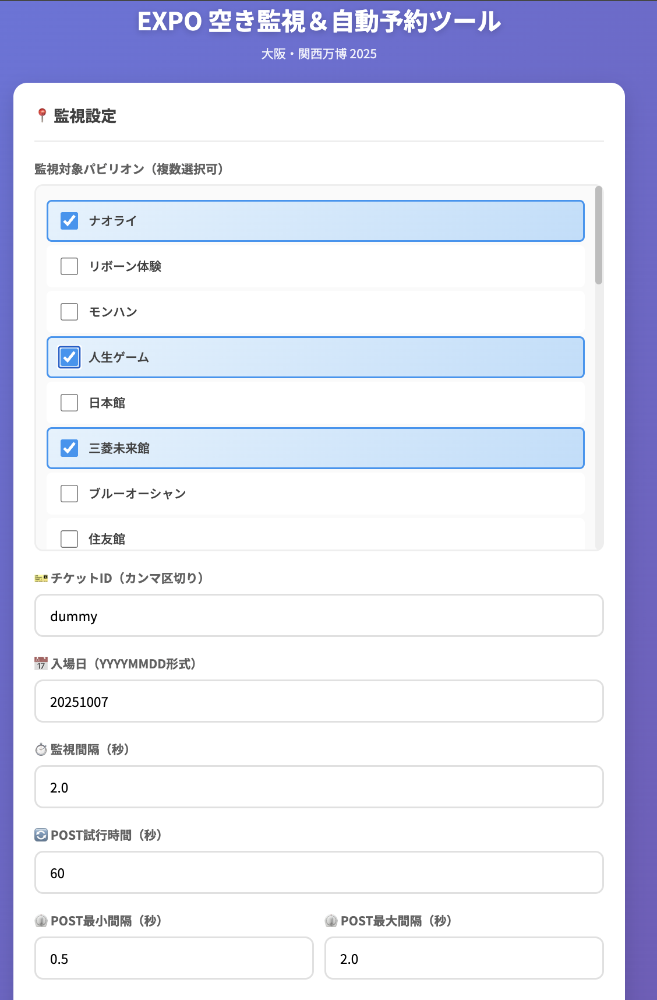
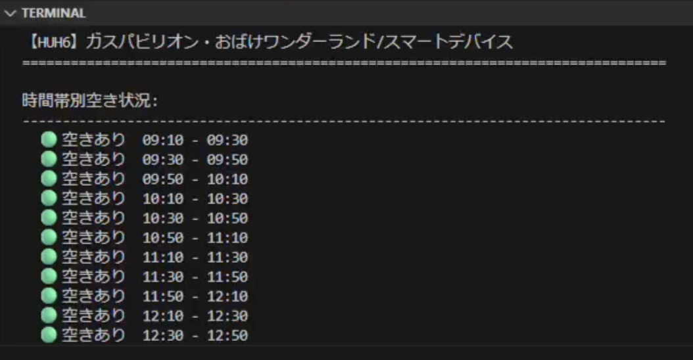
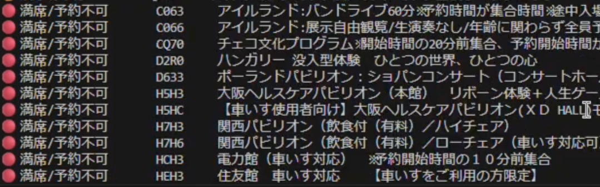
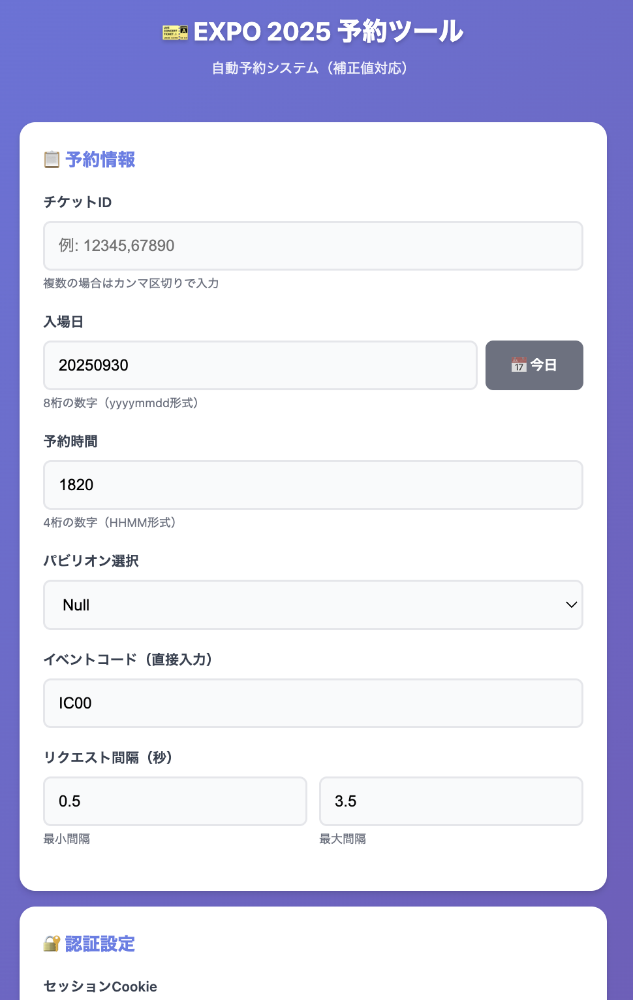
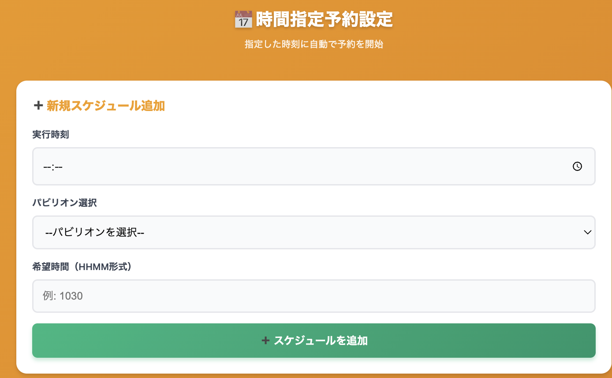

# EXPO 2025 自動当日登録システム

万博2025の当日登録を自動化するツールです。  
※このプログラムはclaude（生成AI）を用いて作成しました。

---

## 📋 システム概要

### **authqr.py**
- **機能**: 二段階認証用のTOTPシークレットキーを生成
- **用途**: 初回セットアップ時にQRコードからシークレットキーを抽出

### **autologin.py**
- **機能**: 万博チケットサイトに自動ログイン
- **処理**: Seleniumでブラウザ操作、TOTP認証、Cookie取得

### **FullAutoReserver.py**
- **機能**: パビリオンの空き枠を監視して自動予約
- **処理フロー**:
  1. WebUIでパビリオン選択
  2. https://expo.ebii.net/ から空き枠情報を取得
  3. 空きを検出したら指定時刻にPOSTリクエスト送信

#### FullAutoReserverの画面


### **eventCodeAkiwaku.py** (get関連フォルダ)
- **機能**: 特定パビリオンの時間帯別詳細空き情報を取得
- **処理内容**:
 -  セッションIDをcookie.txtから取得
  - チケットID、日付、イベントコード、チャンネル（例：7日前抽選枠・3日前開き枠・当日予約枠等）を指定して時間帯別の空き状況を確認
  - 🟢空きあり、🟡残りわずか、🔴予約不可の3段階で表示
  - 複数イベントの一括取得・比較が可能
  - JSON形式で詳細データを保存

#### eventCodeAkiwakuの実行結果


### **ZentaiAkiWakuChecker.py** (get関連フォルダ)
- **機能**: 全パビリオンの空き状況を一覧表示
- **処理内容**:
  - セッションIDをcookie.txtから取得
  - チケットID、日付、チャンネル、パビリオン名（任意）を指定して全イベント情報を自動ページング取得
  - 空き状況別フィルタリング（全て/空きあり/残りわずか）
  - CSV出力機能で外部分析も可能
  - イベント名検索機能

#### ZentaiAkiWakuCheckerの実行結果


### **ManualReserver.py** (メインシステム)
- **機能**:
  - Cookieの自動監視と再取得
  - 指定時刻での自動POST（60秒間）
  - 手動での即時POST（時間制限なし）
- **注意**: 実運用時は常にCookie監視を実行しておくこと

#### ManualReserverの画面



---

## 🚀 初期設定

### 0. 必要な環境
- **Python 3.9以上** (推奨: Python 3.9.6)
- Google Chrome (Selenium用)

### 1. 仮想環境の作成とライブラリのインストール
```bash
# 仮想環境の作成
python3 -m venv venv

# 仮想環境の有効化
source venv/bin/activate  # Mac/Linux
# または
venv\Scripts\activate     # Windows

# 必要なライブラリのインストール
pip install -r requirements.txt
```

### 2. 二段階認証の設定
1. [万博チケットサイト](https://usrmng.accounts.expo2025.or.jp/idmng/users/screen/mng/authSetSelectScreen)で二段階認証を **Google Authenticator (OTP)** のみに設定(メール認証等の他の認証は削除)
2. プロフィール設定からQRコードのURLをコピー

### 3. ログイン情報の設定
1. `.env.example` を開いて以下を設定:
```python
LOGIN_ID = "your_id"
LOGIN_PASSWORD = "your_password"
QR_BASE64 = "プロフィールで入手したQRコードのURLを貼り付け"
```
2. 内容を保存後、ファイル名を `.env `に変更

---

## ▶️ 実行手順

**重要: 必ず仮想環境を有効化してから実行してください**
```bash
source venv/bin/activate  # Mac/Linux
# または
venv\Scripts\activate     # Windows
```

1. **autologin.pyの実行**
   ```bash
   python autologin.py
   ```

   **VSCodeで実行する場合**:
   - `Cmd + Shift + P` → 「Python: Select Interpreter」
   - `./venv/bin/python (Python 3.9.6)` を選択

2. **時間補正の設定**
   ```bash
   python adjustment/adjustments.py
   ```

3. **FullAutoReserver.py、ManualReserver.pyを実行**
   - FullAutoReserver.py: ブラウザでhttp://localhost:8080 アクセス
   - ManualReserver.py: ブラウザでhttp://localhost:8090 アクセス
   - それぞれのページでCookieの自動更新を実行する。

---

## 🛠️ 使用技術

### **バックエンド**
- **Python 3.x**
- **FastAPI** - Web API フレームワーク
- **Uvicorn** - ASGI サーバー

### **ブラウザ自動化**
- **Selenium** - Chrome WebDriver による自動ログイン
- **pyotp** - TOTP 二段階認証コード生成

### **画像処理**
- **OpenCV (cv2)** - QRコード読み取り
- **Pillow** - 画像処理

### **HTTP通信**
- **requests** - APIリクエスト送信
- **threading** - 非同期リクエスト処理

### **フロントエンド**
- **Jinja2 Templates** - HTMLテンプレート
- **HTML/CSS/JavaScript** - WebUI

---

## 📌 課題

- [ ] パビリオンの空き枠情報をebii.net経由ではなく、 get関連フォルダのシステムを用いて確認する。
- [ ] POSTリクエストの並列化（Deno/TypeScriptで高速非同期処理）
- [ ] adjustments.pyはその日の最後のパビリオン時間をもとに補正しているため、時間帯によって補正値が異なる場合に対処できない→最初の時間で補正させる。パラメータエラーが起きたらadjutments.pyが自動で走るようにする


